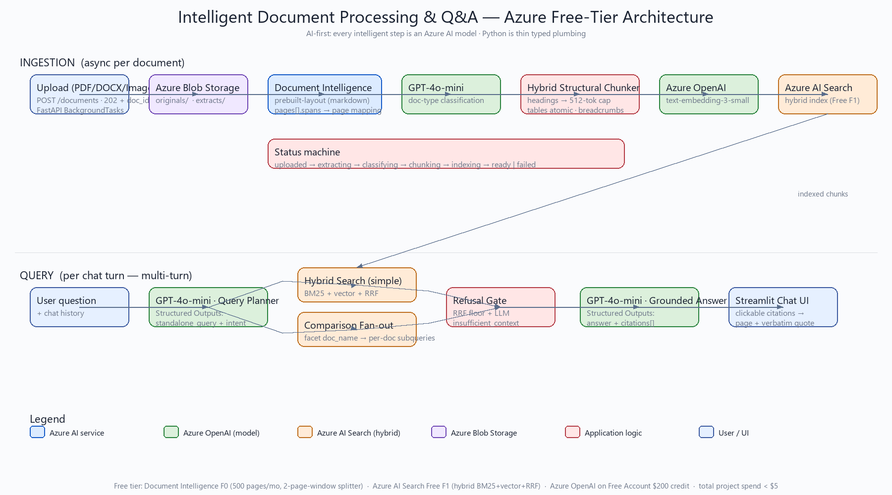
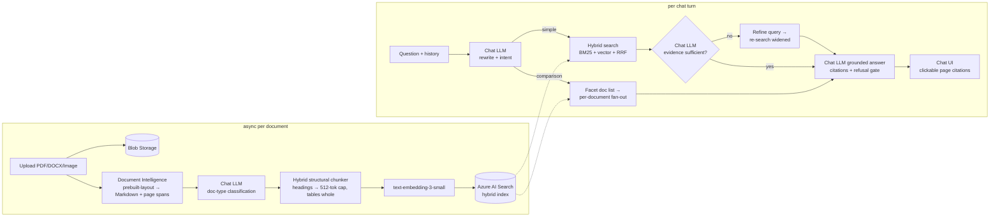

# Intelligent Document Processing & Q&A System

An AI-first, Azure-native RAG system for an insurance operations team: upload policy
documents, claim forms and medical reports (PDF / DOCX / scanned images), and ask
natural-language questions — with **grounded answers, page-level clickable citations,
multi-turn follow-ups, and cross-document comparisons**.

> **Design philosophy:** every step that requires intelligence is delegated to an Azure
> AI model; Python is a thin, typed control plane. Layout detection → Document
> Intelligence. Document classification, coreference resolution, query planning,
> **agentic retrieval self-grading**, grounded synthesis, refusal decisions, and
> evaluation → an Azure chat model. Lexical + semantic ranking → Azure AI Search.
> There are no hand-rolled heuristics, and **no orchestration framework** — the agentic
> loop is plain, testable code on the Azure SDKs (assignment §2).

> **Chat model — free by design.** The chat model is env-pluggable. The reference
> deployment runs **Kimi-k2.6**, a free serverless model on Azure AI Foundry, in place of
> the paid Azure OpenAI GPT-4o (the assignment asks for "GPT-4o **or equivalent**", §5,
> and permits free-tier substitutions, §10). The code **auto-detects model capabilities**
> at runtime — deployments that support Structured Outputs (gpt-4o) use the schema-enforced
> path; those that don't (Kimi) transparently fall back to JSON mode — so the same codebase
> runs on either with zero edits. Set `AZURE_OPENAI_CHAT_DEPLOYMENT` to your deployment name.

---

## Azure Free Tier — zero ongoing cost

This solution runs entirely on **Azure Free Tier SKUs** plus the **Azure Free Account
$200 credit / 30 days** (the credit is the only path to Azure OpenAI, which has no
permanent free tier). Total project spend: **under $5 of the credit** — every other
service is permanently free.

| Service | SKU used | Permanent cost | Notes |
|---|---|---|---|
| **Azure AI Document Intelligence** | **F0 free tier** | $0 | 500 pages/month; F0 silently caps analysis at the first 2 pages of any request → defeated by the page-window splitter (see Design decisions §1). |
| **Azure AI Search** | **Free F1 tier** | $0 | 50 MB, 3 indexes, hybrid BM25+vector+RRF supported. Semantic ranker is paid-only → free-tier refusal gate uses LLM groundedness self-assessment (Design decisions §4). |
| **Azure OpenAI** (gpt-4o-mini + text-embedding-3-small) | Pay-as-you-go on the **$200 free credit** | $0 (within credit) | Whole project consumes < $5 of credit. After 30 days the credit expires; the resource keeps working but bills against pay-as-you-go — **delete the resource group after the demo** to stay at $0. |
| **Azure Blob Storage** | Free account 5 GB / 12 months | $0 | Optional — the app degrades to local disk when `BLOB_CONNECTION_STRING` is empty. |

> **About the card on signup:** the Azure Free Account requires a credit card for
> identity verification only. **You are NOT charged** unless you manually upgrade to
> pay-as-you-go. Free-tier SKUs (DI F0, Search F1) never bill; the OpenAI resource
> bills against the free credit until it runs out. *Alternative with no card:*
> [Azure for Students](https://azure.microsoft.com/free/students/) gives $100 of
> credit with just GitHub Student Pack verification — no card required.

## Architecture





**Data flow:** `POST /documents` returns `202 + doc_id` immediately; a background task runs
extract → classify → chunk → embed → index with a per-stage status machine
(`uploaded → extracting → classifying → chunking → indexing → ready | failed`). The UI
auto-polls via an `st.fragment(run_every=…)` **only while ingestion is in flight** (it goes
calm — no flicker — once everything is ready) and renders a live status card per document.
Chat turns run **plan → retrieve → self-grade → (corrective re-query) → generate**; the
`POST /chat/stream` SSE endpoint emits typed `planning / planned / retrieving / grading /
refining / graded / retrieved / generating / token / done` events so the UI shows an
*agentic trace* — including the evidence-sufficiency check — in real time. One correlation
ID traces the whole turn through every structured log line.

## Azure services used and why

| Service | Role | Why this choice |
|---|---|---|
| **Azure AI Document Intelligence** (`prebuilt-layout`, API 2024-11-30, Markdown output) | Extraction | One API covers all 5 required formats with OCR, tables, heading hierarchy, and `pages[].spans` — the character offsets that make **exact page citations** possible. Chosen over the AI Search Layout *skill*, whose markdown mode drops page numbers and text mode drops headings. |
| **Azure AI Search** (Free tier) | Retrieval | Hybrid BM25 + vector + RRF in one query. Insurance questions mix exact tokens (policy numbers, "$500") where BM25 wins and paraphrases ("outpatient" vs "ambulatory") where vectors win. Push-model indexing keeps chunk metadata (page, section, type) under our control. |
| **Azure chat model** (reference: **Kimi-k2.6**, free serverless on Azure AI Foundry; or Azure OpenAI gpt-4o/-mini) | All reasoning | Handles query planning, classification, retrieval self-grading, grounded answering and LLM-judge evaluation. Kimi is a **free** GPT-4o-*equivalent* chat-completions model on Azure (§5 "or equivalent", §10 free-tier substitution); `AZURE_OPENAI_CHAT_DEPLOYMENT` is env-switchable to gpt-4o. Capabilities are auto-detected (Structured Outputs vs JSON mode). |
| **Azure OpenAI embeddings** (text-embedding-3-small, 1536-d) | Vector search | 3-small beats the brief's example ada-002 on MTEB at ~1/5 the price ("or equivalent" exercised); cost is pennies (the only non-free line, ~$0.10–0.50 total). |
| **Azure Blob Storage** | Originals + extracts | Citation click-through and re-processing without re-paying extraction. Optional — the app degrades to local disk so the core flow runs with just three services. |

## Key design decisions (and rejected alternatives)

1. **Free-tier-first, by design.** Document Intelligence **F0** analyzes only the first
   2 pages of any request — silently. The ingestion pipeline defeats this with a
   **page-window splitter**: PDFs are split into 2-page windows (pypdf — pure plumbing),
   analyzed per window, and merged with page-number + character-offset shifts so citations
   stay exact. A page-count assertion makes truncation impossible to miss. On a paid S0
   resource, set `DOCINTEL_PAGE_WINDOW=0` and documents go whole.
2. **Chunking = structure-first, size-capped** (the assignment's "justify your choice"):
   split on the layout model's detected headings (H1–H3), cap at 512 tokens with ~80-token
   overlap, never split tables, prepend the heading breadcrumb to every chunk. Pure
   fixed-size windows sever tables from the sections that give them meaning; pure
   structural chunks blow up on long sections. Hybrid is also Microsoft's documented
   pattern for exactly this document class.
3. **Citations are data lineage, not prompting.** Chunk character offsets → DI page spans
   → `page_start/page_end` index fields → Structured Outputs `citations[]` schema → UI.
   The model emits a typed citation object; nothing is regex-parsed from prose.
4. **Refusal gate (hallucination control), free-tier edition.** The free Search tier has
   no semantic reranker, so instead of a rerankerScore threshold: (a) an RRF floor +
   empty-result pre-gate refuses before spending tokens; (b) the answer schema's
   `insufficient_context` flag is an LLM groundedness self-assessment — the model judges
   whether the sources answer the question, returned as a typed field. On Basic+ tier the
   calibrated semantic `rerankerScore` gate slots in (one config change).
5. **Comparison questions get per-document fan-out.** Naive top-k lets one verbose policy
   crowd out the rest. A structured-output planner detects comparison intent; a facet
   query enumerates documents (zero extra infra); the same hybrid sub-query runs per
   document with a filter so **every policy is guaranteed representation**; synthesis
   returns a cited comparison table. Azure AI Search's managed *agentic retrieval* (GA
   2026) is the production evolution of this layer — hand-rolled here for explainability.
6. **Multi-turn = LLM query rewriting.** One structured call condenses (history + new
   question) into a standalone query (resolving "that same policy") *and* routes intent —
   the canonical pattern from Microsoft's azure-search-openai-demo. Raw history pollutes
   retrieval; Search's built-in `queryRewrites` is preview and not conversation-aware.
7. **No orchestration framework (assignment §2: "no third-party wrappers unless justified").**
   The RAG loop is a few hundred lines of visible, testable code on the stable Azure SDKs —
   the lowest-risk dependency surface, and the most directly graded ("correct and efficient
   use of Azure SDKs", §8 Azure Integration). A wrapper like LangChain/LangGraph would hide
   exactly the retrieval, grounding and citation decisions this exercise assesses, so the
   "smart" behaviour is built explicitly instead (see §8 below).
8. **Agentic, self-correcting retrieval (Corrective-RAG).** A simple-intent turn doesn't blindly
   trust its first search. An LLM **retrieval critic** judges whether the retrieved snippets can
   answer the question; if not, it proposes a **refined query** and the loop re-searches (widened
   top-k) and merges the evidence before generating — a genuine "is this enough, and if not, how do
   I search better?" decision, surfaced live in the UI trace. It is bounded (`AGENTIC_MAX_RETRIES`,
   default 1), fails open (any grader error proceeds with the original evidence, never blocking an
   answer), and is disableable (`AGENTIC_RAG=false`) for the leanest path. Comparison intent already
   fans out across every document, so grading is applied only to simple-intent turns.

## Assignment requirements — line-by-line coverage

| Requirement (assignment §) | Where it's implemented |
|---|---|
| **§2** Azure SDKs / REST APIs, no third-party wrappers | `azure-ai-documentintelligence`, `azure-search-documents`, `azure-storage-blob`, `openai` (Azure flavour). No LangChain / SK / framework — see Design decisions §7. |
| **§2** Python backend, modern-framework frontend | FastAPI + Streamlit |
| **§2** Config file / env vars for reviewers' Azure credentials | [`.env.example`](.env.example) → `src/core/config.py` (`pydantic-settings`) |
| **§4.1** Accept PDF, DOCX, JPEG, PNG, TIFF | [`src/ingestion/extractor.py`](src/ingestion/extractor.py) `SUPPORTED_EXTENSIONS` |
| **§4.1** Document Intelligence — text, tables, key-value pairs, layout | [`src/ingestion/extractor.py`](src/ingestion/extractor.py) `prebuilt-layout`, markdown output |
| **§4.1** Batch uploads + per-document status tracking | [`src/api/main.py`](src/api/main.py) `POST /documents` accepts `list[UploadFile]`; [`src/ingestion/status_store.py`](src/ingestion/status_store.py) status machine |
| **§4.2** Chunking strategy with **justification** | [`src/indexing/chunker.py`](src/indexing/chunker.py) (hybrid structural + size-capped). Trade-offs documented in **Design decisions §2** below |
| **§4.2** Index chunks in Azure AI Search with metadata: **doc name, page, section, doc type, upload timestamp** | [`src/indexing/index_manager.py`](src/indexing/index_manager.py) — all five fields present, filterable/facetable as needed |
| **§4.3** Chat interface | [`frontend/app.py`](frontend/app.py) (Streamlit) |
| **§4.3** RAG: embed query → **hybrid keyword+vector** retrieval → GPT-4o → grounded answer | [`src/retrieval/searcher.py`](src/retrieval/searcher.py) hybrid + RRF; [`src/generation/answerer.py`](src/generation/answerer.py) |
| **§4.4** Citations: source doc + page + snippet, **clickable to original** | Structured Outputs schema in [`src/generation/schemas.py`](src/generation/schemas.py); UI renders citation chips that open an **embedded PDF/image preview** of the cited page via `GET /documents/{id}/file` (`#page=N` jump for PDFs) in [`src/api/main.py`](src/api/main.py) |
| **§4.5** Multi-turn with follow-up reference resolution ("does *it* cover…") | [`src/retrieval/query_planner.py`](src/retrieval/query_planner.py) LLM rewrite + intent; `_sessions` history in [`src/api/main.py`](src/api/main.py) |
| **§5** Azure Document Intelligence | extractor.py |
| **§5** Azure AI Search (analyzers, hybrid search) | `en.microsoft` analyzer + HNSW vector + RRF in index_manager.py / searcher.py |
| **§5** Azure OpenAI (embeddings + chat) | embedder.py + answerer.py + query_planner.py |
| **§5** Azure Blob Storage (originals + extracts) | [`src/ingestion/blob_store.py`](src/ingestion/blob_store.py) |
| **§6** Error handling (unsupported formats, OCR fails, empty results, throttling) | 415 + 413 in api/main.py; ExtractionError → `failed` status; refusal gate; tenacity backoff in extractor.py / embedder.py / searcher.py |
| **§6** Structured logging tracing the full pipeline | [`src/core/logging.py`](src/core/logging.py) JSON + correlation IDs per document/turn |
| **§6** Configuration externalised | `.env.example` + pydantic-settings |
| **§6** Modular separation of concerns | `src/ingestion ‖ indexing ‖ retrieval ‖ generation ‖ api ‖ core` |
| **§6** Security: no hardcoded credentials, Azure Identity SDK | [`src/core/azure_clients.py`](src/core/azure_clients.py) — `DefaultAzureCredential` preferred; key fallback via env only |
| **§7** All four sample test scenarios | Demo with [`sample-documents/`](sample-documents/); scripted in [`evals/golden_set.jsonl`](evals/golden_set.jsonl) |
| **§9.1** Recommended repo structure | matched 1:1 (see *Repository structure* at the bottom) |
| **§9.2** README sections | this file — overview, architecture, services + rationale, setup, run, limitations, future improvements |
| **§9.1** `architecture.png` | [`architecture.png`](architecture.png) (regenerate with `python scripts/make_architecture_png.py`) |
| **§10** "Document resource limitations and how you'd implement with full access" | Free-tier table above + Known limitations & production path below |

## Setup

> 📘 **Full step-by-step provisioning, the free Foundry/Kimi path, and troubleshooting live in
> [`docs/SETUP.md`](docs/SETUP.md).** The quickstart below is the automated Azure-CLI path.

**Cost: $0 out of pocket** when you stay on free SKUs and delete the resource group
after the demo. The Azure Free Account requires a card for identity verification only,
not for billing — see the *Azure Free Tier* section above.

```bash
# 1. Provision (or create the four resources in the portal)
az login
bash infra/provision.sh rg-docqa-demo eastus     # prints every value .env needs

# 2. Configure
cp .env.example .env                              # paste the printed endpoints/keys

# 3. Install & test
python -m venv .venv && .venv\Scripts\activate    # Windows (use source .venv/bin/activate on *nix)
pip install -r requirements.txt
pytest                                            # offline golden tests (chunker, page mapper)

# 4. Generate the demo corpus
python scripts/make_samples.py                    # 2 policies, scanned claim form, DOCX report

# 5. Run
uvicorn src.api.main:app --reload                 # backend  → http://localhost:8000/docs
streamlit run frontend/app.py                     # UI       → http://localhost:8501

# 6. Verify everything end to end
python scripts/smoke_test.py
python evals/evaluate.py                          # golden-set eval (after ingesting samples)
```

Authentication: leave the `*_KEY` vars empty to use `DefaultAzureCredential`
(`az login` locally / managed identity in the cloud — required RBAC roles:
*Cognitive Services OpenAI User*, *Cognitive Services User*, *Search Index Data
Contributor*, *Storage Blob Data Contributor*). Keys via `.env` are the
low-friction fallback for free-trial reviewers.

## UI walkthrough

The Streamlit frontend is built as a **two-step, guided flow** for an insurance operations
analyst — a non-technical reviewer should land on it and feel productive within 10 seconds.
It runs on a locked light theme (`.streamlit/config.toml`) so it renders identically on any
machine.

- **Top bar** — product identity plus pills for the active chat model, the session id, and
  a health indicator (how many Azure services are configured).
- **① Your documents** (left) — drag-drop multi-upload (ingestion starts automatically, no
  button), a one-click **Load demo corpus**, and a clean per-document card showing type,
  a live progress bar with the current stage while processing, and `pages · chunks` when ready.
  The list **auto-refreshes only while something is processing**, then goes completely calm
  (a fragment re-runs in place — the whole page never reloads, so there's no flicker).
- **② Ask your documents** (right) — **state-aware and gated**: a cold-start hero with a
  3-step "how it works" strip when empty, an "indexing…" notice while documents process, and
  suggested-question chips once at least one document is ready. The chat input stays disabled
  (with an explanatory placeholder) until you can actually get a grounded answer.
- **Agentic trace** — each turn streams a live trace: *understanding → searching → checking
  the evidence is sufficient* (the Corrective-RAG step; shows "re-searching" when it refines)
  *→ grounding the answer*, with tokens streaming in as the model writes.
- **Citations** — every `[n]` becomes a clickable chip that opens a preview dialog with the
  verbatim quote and an **embedded PDF/image render of the exact cited page** (PDFs jump to
  `#page=N`; images render at full width), plus a footer with rewritten query · intent ·
  confidence · citation count, and an honest "insufficient context" notice when relevant.
- **Controls** — *New chat* (also clears the server-side session).

## Performance notes

- **No wasted round-trips on Kimi.** Structured Outputs is attempted only when the deployment
  supports it; the result is cached process-wide (`STRUCTURED_OUTPUTS=auto`), so Kimi turns go
  straight to JSON mode instead of failing a schema call first on **every** planner + answerer
  request. Set `STRUCTURED_OUTPUTS=off` to skip it from turn one.
- **Faster reloads.** `tiktoken` (the BPE table is ~1 s to load) is now loaded lazily on first
  chunk rather than at import, so backend `--reload` cycles are quicker. For demos/recording,
  run `uvicorn src.api.main:app` **without** `--reload`.
- **Cold-start hiding.** Free serverless models scale to zero; set `WARMUP_ON_STARTUP=true` to
  fire a tiny embed+chat call on boot (in a daemon thread) so the first real question is fast.
- **Already-parallel:** multi-document ingestion, F0 page-window extraction, embedding batches,
  and comparison fan-out all run concurrently across thread pools.

## Sample test scenarios (assignment §7)

| Scenario | Try |
|---|---|
| Multi-page policy | *"What is the maximum coverage for outpatient treatment under this policy?"* |
| Scanned claim form | *"What is the claim amount and the date of service?"* |
| Follow-up | *"What is the Gold Shield deductible?"* → *"Does it also cover pre-existing conditions?"* |
| Cross-document | *"Compare the deductible clauses across all uploaded policies."* |
| Honest refusal | *"What's the dental limit on the Platinum Elite policy?"* (not in corpus) |

## Known limitations & production path

- **DOCX page numbers are synthetic** (DI treats 3,000 chars as one "page") — DOCX
  citations anchor to section headings instead of faking page numbers; the UI says so.
- **Free Search tier:** no semantic reranker (design seam documented above), 50 MB index,
  no SLA. Production: Basic/S1 + semantic ranker + freshness scoring profile. **Free drop-in
  today:** a **Cohere Rerank** serverless deployment on Azure AI Foundry (also free) can act as
  an L2 reranker over the hybrid candidates — a clean future enhancement that needs only a
  rerank call between `searcher.hybrid_search` and the answerer.
- **In-process ingestion + in-memory sessions with 24-hour sliding TTL** (demo scope).
  Production: Blob → Event Grid → Service Bus → KEDA-scaled workers behind the same
  `process_document` seam; sessions in Cosmos DB; hosting on Azure Container Apps per
  the Microsoft baseline.
- **Security production path:** user-assigned managed identity everywhere, key auth
  disabled, private endpoints, Prompt Shields on retrieved content (uploaded documents
  are an injection vector in RAG), Data Zone deployments + modified abuse monitoring for
  PHI, App Insights with OpenTelemetry GenAI tracing, cost budgets with alerts.
- Figure/image verbalization (stamps, signatures on claim forms) and table-summary
  augmentation chunks are the next quality wins.

## Repository structure

```
src/ingestion/   upload → DI extraction (F0 window splitter) → status machine → blob
src/indexing/    hybrid structural chunker · span→page mapper · embeddings · index-as-code
src/retrieval/   structured query planner (rewrite+intent) · hybrid search · comparison fan-out
src/generation/  grounded answering · Structured Outputs citations · refusal gate · RAG service
src/api/         FastAPI endpoints (upload, status, file, chat)
frontend/        Streamlit chat UI with citation panel
tests/           offline golden tests (chunker, page mapper)
evals/           golden set + LLM-judge eval harness (groundedness / relevance)
infra/           az-cli free-tier provisioning script
scripts/         sample-document generator · pre-demo smoke test
```
